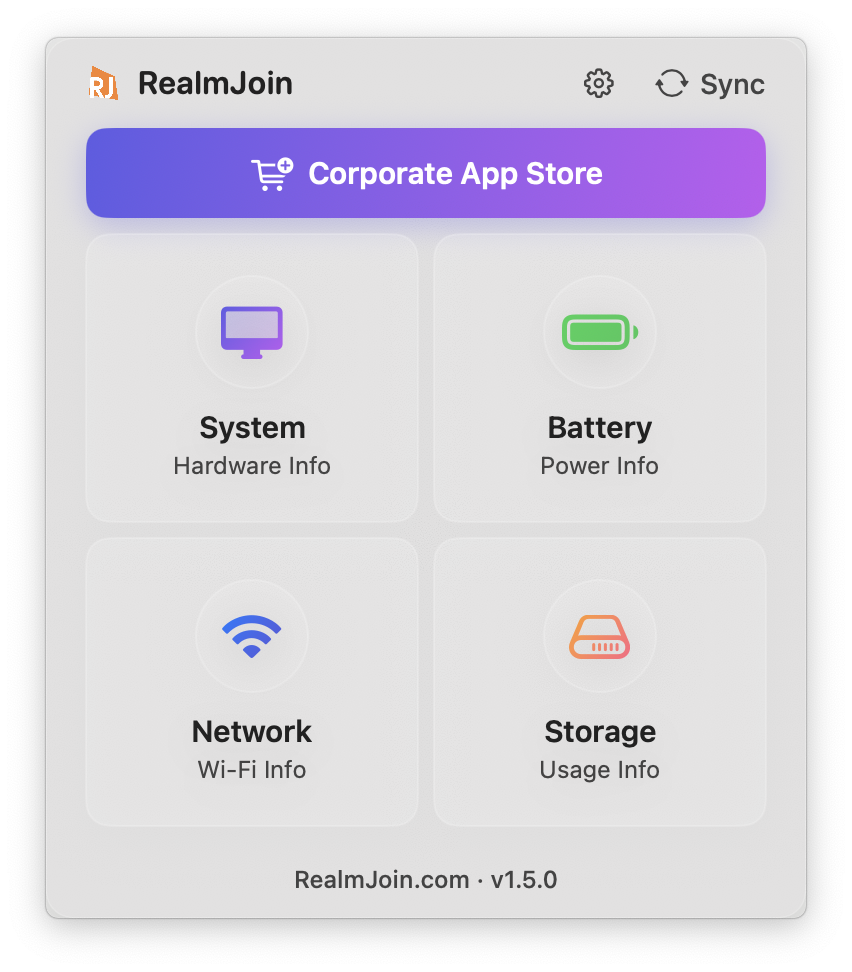

# RealmJoin macOS Agent

A beautiful macOS menu bar application that provides real-time system monitoring with a Liquid Glass UI design.

  

## What is RealmJoin Agent?

RealmJoin Agent is a comprehensive menu bar application designed for enterprise macOS device management. It sits in your Mac's status bar and provides:

### Core Features

- 🖥️ **System Monitoring**: Real-time hardware details, RAM usage, uptime, OS version
- 🔋 **Battery Management**: Charge level, health status, cycle count, condition monitoring
- 📡 **Network Status**: Wi-Fi SSID, IP address, connectivity checks
- 💾 **Storage Analytics**: Visual disk usage indicators with progress bars
- 🛠️ **IT Tools Integration**: Quick access to self-service portal with Intune device ID
- 🔄 **Automatic Updates**: Seamless updates via Sparkle framework
- 📊 **Telemetry Collection**: Anonymous usage metrics for fleet management
- 📝 **Diagnostic Logging**: One-click log collection for troubleshooting

### Enterprise Features

- **Intune Device ID Integration**: Automatic device identification for corporate portals
- **MDM Deployment Ready**: PKG installer optimized for Intune/Jamf deployment
- **System-wide LaunchAgent**: Automatic startup for all users
- **Privacy-focused Telemetry**: SHA256 hashed identifiers with local storage
- **Comprehensive Logging**: Application and system log collection

## Quick Start

> [!TIP]
> Download the "RealmJoin Agent.pkg" installer from this repository and run it to install the application.

## Installation Methods

### Method 1: PKG Installation (Recommended)

The PKG installer provides a complete installation experience for both end users and enterprise deployments:

1. Download `RealmJoin Agent.pkg` from this repository
2. Double-click the PKG file to run the installer
3. Follow the installation wizard
4. The installer will:
   - Install the app to `/Applications`
   - Configure system-wide LaunchAgent for auto-start
   - Create logs at `/Library/Logs/RealmJoin/`
   - Set up automatic startup for all users
5. After installation, look for the ⓘ icon in your menu bar

### Method 2: Intune Deployment

The PKG installer is optimized for Microsoft Intune deployment:

1. Download `RealmJoin Agent.pkg` from this repository
2. Upload to Microsoft Intune
3. Deploy to target devices
4. The installer handles all configuration automatically

## License

Copyright © 2025 RealmJoin. All rights reserved.
